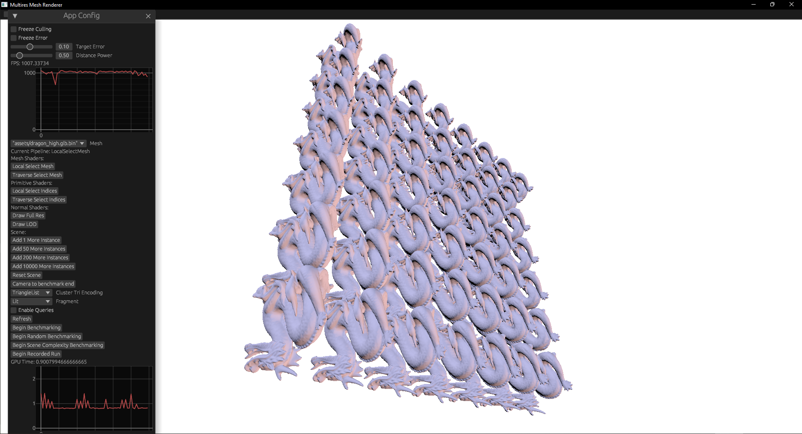
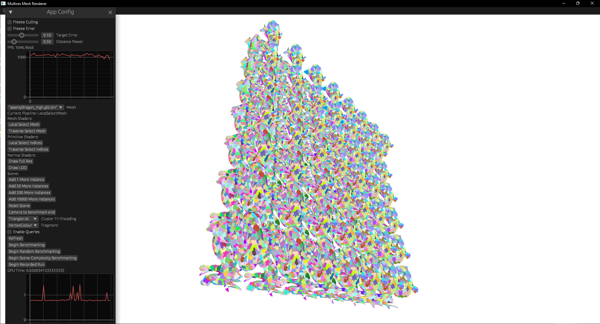
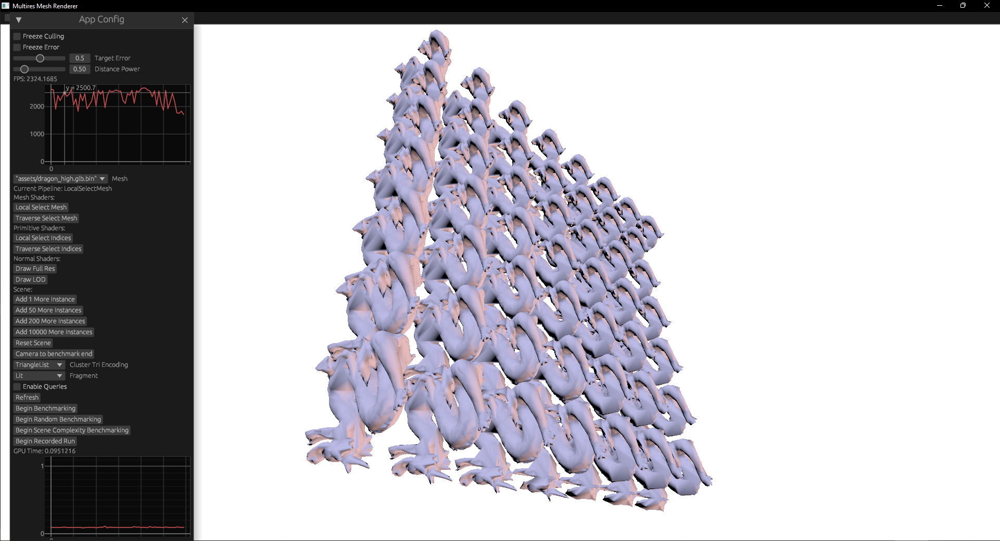
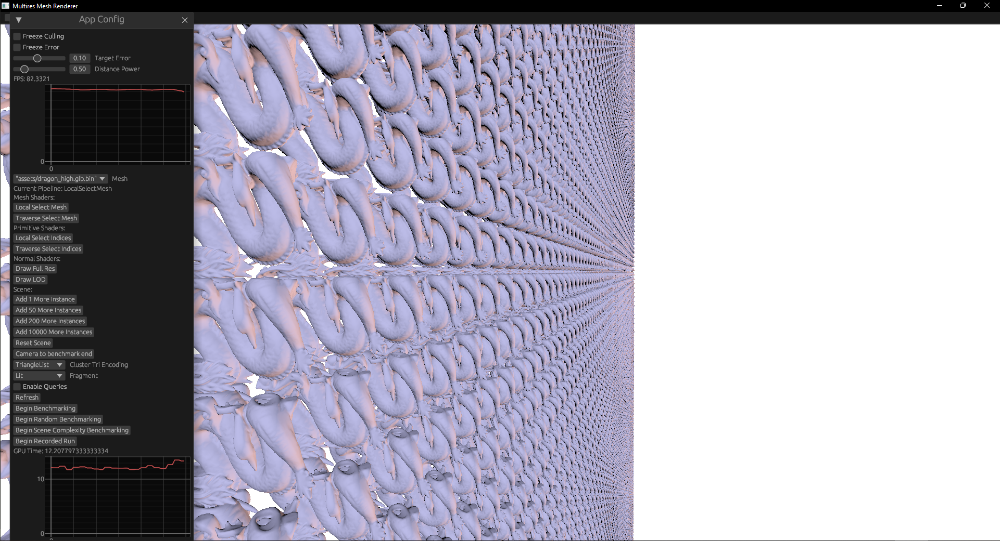

# Multires

This repository is a proof of concept implementation of a multiresolution mesh rendering system following designs originally developed in _Batched Multi-Triangulation_ and _Nanite_.

It contains:

- Two simplification backends:
   	- Quadric error metrics (custom implementation, non uniform tessellation)
   	- `meshopt` (no support for simplifying boundaries)
- Two procedural geometry backends:
   	- Primitive shading (proof of concept, slow)
   	- Mesh Shading (blazing fast)
- Two cluster selection algorithms:
   	- DAG traverse - explore the DAG from the roots down, finding clusters that fit the error threshold.
   	- Adaptive Select - dispatch an invocation for each cluster that may be drawn (based on last frame). With mesh shading, this dispatches task shaders, with no intermediate memory usage.

## Baking Meshes

First, obtain a `.glb` mesh. For best results, ensure no microholes/small gaps and smooth geometry.
My demo mesh is a cleaned up version of the stanford dragon, available [here](https://github.com/pettett/dragon_high).

Bake the mesh with default settings:

```
mkdir assets
cargo run -r --bin=baker -- --input=MODELS_DIR/dragon_high.glb --output=assets/
```

A large amount of text detailing each pass of simplification is expected.

The result will be a file `assets/dragon_high.glb.bin`, a binary encoding of the mesh. No effort has been put into optimising the file size of the outputs, and it is expected to be around 190% the size of the original glb.

### Options

The readout from `--help` is:

```
Usage: baker.exe [OPTIONS] --input <INPUT> --output <OUTPUT>

Options:
  -i, --input <INPUT>            The path to the mesh to read
  -o, --output <OUTPUT>
  -m, --mode <MODE>              [default: dag] [possible values: dag, chain]
  -s, --simplifier <SIMPLIFIER>  [default: quadrics] [possible values: quadrics, meshopt]
```

`--mode=dag` generates a multiresolution, while `--mode=chain` creates an LOD chain for comparison purposes.

`--simplifier=quadrics` uses my own implementation of quadric error metrics, while `--simplifier=meshopt` uses the popular meshopt library. Meshopt produces better simplifications but is unable to handle non-watertight meshes well.

`--output` specifies the _folder_ where files matching the input glob are saved.

## Viewing Meshes

Once a `.glb.bin` file is obtained, the mesh can be viewed with `ash_renderer`. While the application works without _mesh shader_ support, performance is suboptimal - if your device does not support mesh shaders, only view a couple of instances at a time.

`renderer.toml` contains the configuration for the renderer, as opposed to command line arguments. `mesh_names` contains the list of meshes that will be loaded for possible viewing, although currently only one mesh can be previewed at a time.

```toml
mesh_names = [
	"assets/dragon_high.glb.bin",
]
starting_error = 0.10
validation = false
```

`validation` enables Vulkan validation layers if true, for debug only. `starting_error` controls the default "error" of generated view-dependent LODs.

Building the renderer requires the Vulkan SDK to be installed to compile shaders.

```
cargo run -r --bin=ash_renderer 
```

You should see a window with a side UI panel and a white screen. Press the "Add 50 Instances" button to create some meshes!



To see what clusters the renderer is selecting, switch the "fragment" dropdown from "Lit" to "VertexColour" (only works with mesh shaders, otherwise appears black).



Changing the "Target Error" slider will alter what level of detail of clusters the algorithm selects - here is an error of 0.5:



Finally, the scalability of task+mesh shaders combined with good culling allows us to render a source scene with many billions of triangles (up to 200 billion on my GTX 1660).


